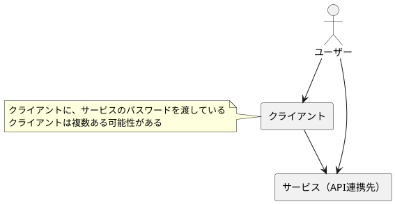

# ゼロから設計するOAuth

> OAuthって何？Authorization Code Flowとは？

これを解説する本や記事はたくさんあると思います。一方で

> なぜAuthorization Codeとaccess tokenを分けるの？セキュリティ的な安全性はどう担保しているの？

といった問いに答えるものは意外と少ないのではないでしょうか。

このリポジトリでは、「ゼロからOAuthを設計するとどうなるの？」を出発点に、セキュリティ面も気にしながらOAuthを設計していきます。

もしかしたらOAuthと同じものができるかもしれないし、ちょっと違うものができるかもしれない。あとから脆弱性が見つかってしまうかもしれない。それでも、ゼロから考えることで得られる学びもあるはずです。

みなさんも、一緒に設計しませんか？

## 出発点

> ゼロからOAuthを設計するとどうなるの？

この問いが出発点ですが、「OAuthとは？」を定義しておきます。もちろん、OAuthの仕様はRFCで公開されていますが、それをそのままコピペするわけにはいきません。

ここで、"本物の"OAuthと、これから設計するOAuthを呼び分けるために、以下の呼び方を定義しておきます。

- OAuth：現在、RFC(RFC6749)で定義されているOAuth。本リポジトリでは、明示的に「本物のOAuth」と呼ぶこともあります。
- ZeroAuth：本リポジトリで設計していく"OAuthもどき"。RFCや本物のOAuthとは無関係。

ここで、ZeroAuthは、本物のOAuthとは無関係…とはいえ、共通点は存在します。それは、OAuthの目的（解決したい課題）です。

その目的を達成するために、（なるべくOAuthに引っ張られないように）ZeroAuthを設計していきます。

### OAuthの目的

本リポジトリでは、**OAuthの目的を以下とします**。

```txt
（API連携において）クライアントアプリにサービスのパスワードを渡したくない。

なぜなら、
- パスワードを渡すことは、実質全ての権限を渡すことに等しいため
- いずれかのサーバーからパスワードを流出すると、全てのパスワードを変更しなければいけない
- 一つのサービスから退会したい場合に、そのサーバーに渡したパスワードだけを無効化することができない
```

なお、システム構成としては、以下の想定です。



例えば、家計簿アプリがあります。
- ユーザー：家計簿アプリのユーザー（みなさん）
- クライアント：家計簿アプリ（スマホアプリ、webアプリなど）
- サービス：銀行

この例だと、銀行のパスワードを家計簿アプリに直接渡すことになります。しかし、銀行のパスワードを渡すの、少し抵抗があると思います。

また、クライアントは他にもあるかもしれません。例えば、別の家計簿アプリ（併用や乗り換えなど）を使っている場合です。

もちろん、SNS連携など、他の例はたくさんあります。
