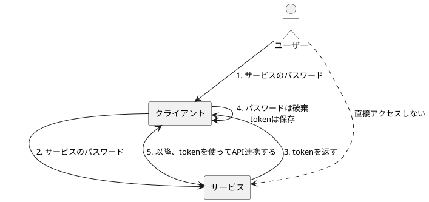
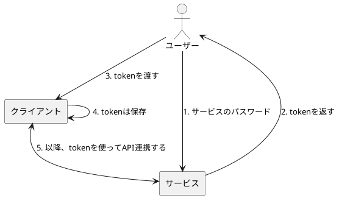

# Day1

まずは、ZeroAuthの最初の形を考えてみます。改めて、目的は以下です。

> （API連携において）クライアントアプリにサービスのパスワードを渡したくない。
> 
> なぜなら、
> - パスワードを渡すことは、実質全ての権限を渡すことに等しいため
> - いずれかのサーバーからパスワードを流出すると、全てのパスワードを変更しなければいけない
> - 一つのサービスから退会したい場合に、そのサーバーに渡したパスワードだけを無効化することができない

## まずはパスワードをやめる

目的に照らして、まずはパスワードをやめることを考えるのが第一だと思います。となると、`token`は必要ですよね（OAuthに引っ張られている？）

ここで、二つのパターンを考えました。

- パターン1：`token`を取得するのはクライアント
- パターン2：`token`を取得するのはユーザー

### パターン1

上図の通り、以下の流れでやり取りを行います：

1. ユーザーは「サービスのパスワード」をクライアントに渡す
2. クライアントは「サービスのパスワード」をサービスに渡して、
3. サービスは、クライアントにtokenを渡す
4. クライアントは、「サービスのパスワード」だけ破棄して、tokenのみ保存しておく
5. これ以降、クライアントは`token`を利用して、サービスとやり取り（API連携）する。

### パターン2

上図の通り、以下の流れでやり取りを行います：

1. ユーザーは、パスワードをサービスに渡して、
2. サービスは、ユーザーにtokenを返す
3. ユーザーは、クライアントにtokenを渡す
4. クライアントは、tokenを保存する
5. これ以降、クライアントは`token`を利用して、サービスとやり取り（API連携）する。

### パターン1 vs パターン2

では、パターン1とパターン2のどちらが良いのでしょうか？

メリットデメリットはあるのですが、当初の目的（パスワードを渡したくない）を考えると、パターン2が良いのかなと考えています。

|\ | パターン1 | パターン2 |
|---|---|---|
|メリット| ユーザーの操作が少なくて楽 | クライアントに一切パスワードを渡す必要がない |
|デメリット| クライアントは一度パスワードを見ることができる | ユーザーの操作が煩雑 |

大きく観点を分けると、「パスワードを渡すかどうか」と「ユーザー体験」の2つだと思います。そして前者はセキュリティ観点、後者はユーザビリティ観点に近いです。

そしてセキュリティ面を大事にしたいので、パターン2を採用します。

#### 補足）パターン1で、パスワードを破棄するから安全？

一つの問いとして、「クライアントは、パスワードを破棄するから安全ではないか？」を考えてみたいと思います。

もちろん、クライアントは一度パスワードを見ることができるという点でパターン1よりもリスクは高いです。とはいえ、直後に破棄するなら、ある程度安全ではないか、とも考えられます。

ここで、重要な点は、「本当にパスワードを破棄するのか？」だと思います。パスワードを破棄するかどうかは、完全に実装依存です（クライアントの処理をZeroAuthから強制できない）。

特に、クライアントが、悪意のあるアプリだった場合はどうでしょうか。

この場合、悪意のあるアプリにパスワードを渡してしまうので、完全にアウトです。パターン2なら、tokenは渡してしまいますが、パスワードを渡すよりは影響範囲は小さいです。

ここまでを踏まえると、やはりパターン2が良いと考えられます。

## まとめ

まずはベースとなる設計を考えてみました。

- ユーザーがサービスからtokenを取得する
- ユーザーがクライアントにtokenを渡す
- クライアントとサービスはtokenを基にAPI連携する

（知っている人にとっては）何となくAuthorization Code Flowっぽく見えるのではないでしょうか。ただし、まだまだ違いがあります。

次回以降は、パターン2の問題であるユーザー操作の複雑性や、セキュリティ観点での見直しなどを実施していきたいと考えています。