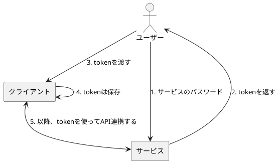
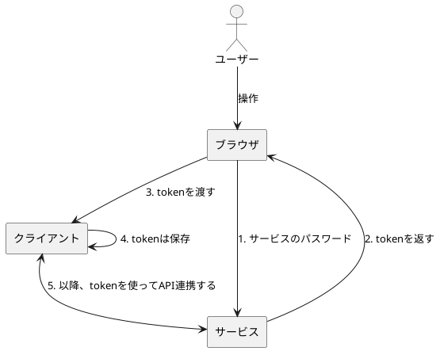
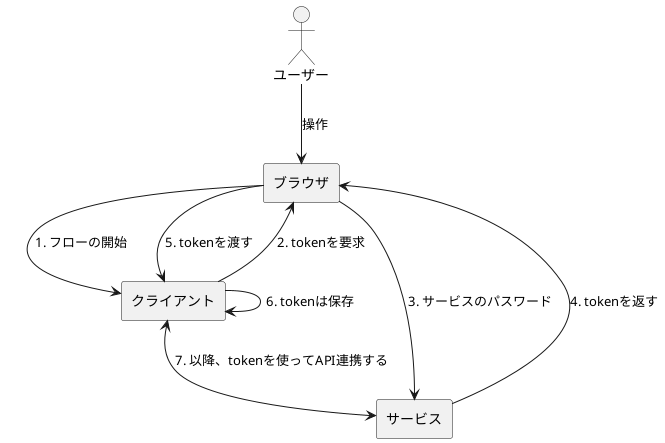
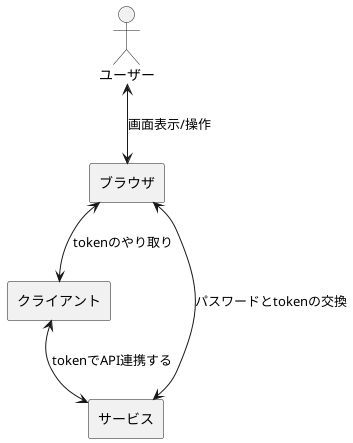
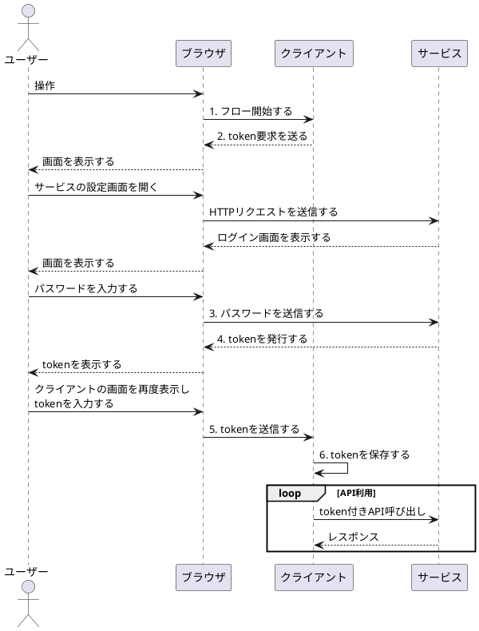
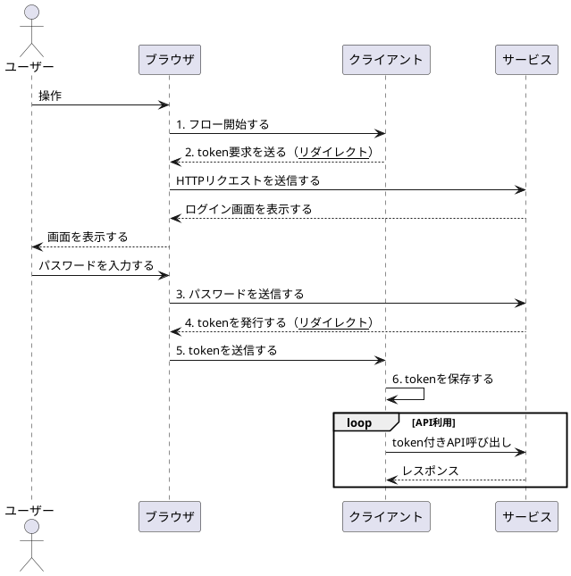
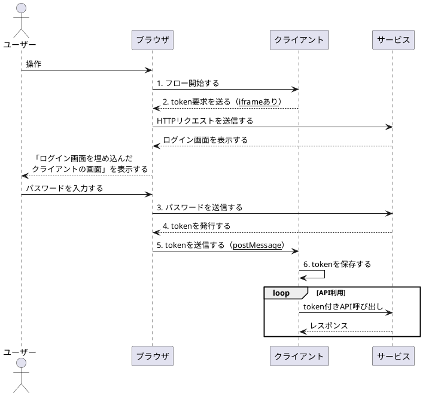
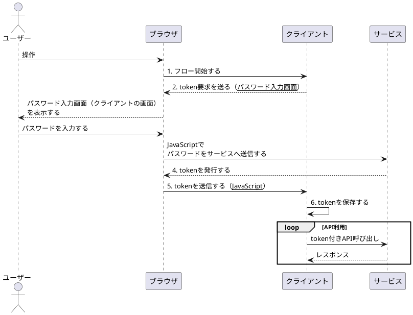

# Day2

Day1では、最初の基本形を設計しました。

今回は、ユーザビリティ観点ではありますが、ユーザー操作の簡略化を考えたいと思います。

## 現状の課題

ユーザーがtoken取得をし、クライアントに渡す必要があり、その手順が煩雑です。

## 改善後の設計

まず、ユーザーによる操作が必須なのは、以下の2点です：

- クライアントに、サービスとの連携を設定する
- サービスに、ログインする

自動化できそうなのはtokenの受け渡しです。

今回は、以下の3パターンを検討したいと思います。

1. リダイレクト型
2. iframe型
3. スクリプト型

ここで、3パターンの検討の前に、基本形のフローを整理したいと思います。

### フローの整理

まず、これまでは「ユーザー」と「クライアント」と「サービス」の3人の登場人物で検討していましたが、実際にはユーザーが操作するのは「ブラウザ」です。さらに、以降では、リダイレクトなどブラウザの機能が必要なため、ユーザーの前に「ブラウザ」を明示して書いておきます。

さらに、フローの開始は、「クライアント側で、サービスとの連携設定をする」ことです。例えば、家計簿アプリ（クライアント）において、○○銀行（サービス）の「連携」ボタンを押すイメージです。

図の中では、単に「フローの開始」と記載することにします。また、その際、クライアントは「tokenを要求する」ため、以下のような図になります。

少し図が複雑になってきました。問題は、コンポーネント図に処理のフローを詰め込んでいることなので、図を分離しておきます。以降では、コンポーネント図とシーケンス図の2つを使っていきたいと思います。

これが今の設計のフローです。なお、シーケンス図の番号は、先ほどのコンポーネント図と合わせています。また、コンポーネント図では省略されていたのですが、ユーザー操作がかなりあって、複雑です。

### 1. リダイレクト型

ユーザー操作を簡略化するための一つ目の方針はリダイレクトです。ユーザーが画面を開いたり、手動でtokenを入力したり、といった操作をリダイレクトに置き換えます。

変更したのは、「2. token要求を送る」と「4. tokenを発行する」をリダイレクトにした点です。これにより、ユーザーは画面遷移やtoken入力を手動で実行する必要がなくなりました（手動で必要なのはパスワード入力だけです）。

### 2. iframe型

次のパターンはiframeを使う方法です。

iframeとは、一つのページに別ページを埋め込む方法（HTMLタグ）です。埋め込むページは、同じドメインでも別ドメインでも可能です。

これを利用すれば、token要求の際に、「サービスのログイン画面」を埋め込むことができ、ユーザー操作を簡略化できます。

補足ですが、親ページ（iframeを埋め込んでいる元のページ）とiframeの間のやり取りは、`postMessage`という機能を使って実装をします。

リダイレクト型と似ていますが、ログイン画面の表示やtokenのやり取り方法が異なります。

### 3. スクリプト型

最後に、スクリプトを使った方法を検討します。こちらは、JavaScriptを活用して、パスワードのやり取り・Tokenのやり取りを行います。ユーザーはクライアントの画面にパスワードを入力し、あとはスクリプトでToken交換を実施するので、ユーザー操作は簡単にできます。

なお、パスワードを「クライアントの画面」に入力していますが、「クライアント（サーバー側）」に送信しているわけではありません。よって、「クライアントアプリにサービスのパスワードを渡したくない。」という目的は（ギリギリ）守られています。

### リダイレクト vs iframe vs スクリプト

ここまで3つの設計を検討していましたが、どれがよいでしょうか？

まず、（お気づきの方も多いかもしれませんが）スクリプト型はNGです。Day1でも検討しましたが、「クライアントが悪意のあるアプリだった場合」を考えてみます。この場合、入力されたパスワードをクライアント（サーバー側）に送信するスクリプトを書くことができます。つまり、簡単にパスワードを奪うことができてしまいます。

次に、iframe型です。こちらもいくつか問題がありそうでした（そもそも、iframe自体が非推奨になる動きもあるようです）。

一つはiframe側のURLが表示されないため、画面上はスクリプト型と区別がつかないことです。つまり、サービスのログイン画面を出しているように見せかけて、実は（悪意のある）クライアント側の偽のログイン画面を出すことができてしまいます。もう一つは、サードパーティーCookieの問題です。iframeの場合、サードパーティーCookieと判定されてCookieが送信されない場合が多いため、（別タブでサービスにログイン済みだとしても）未ログイン状態から始まってしまいます。

最後にリダイレクト型ですが、こちらを採用したいと思います。理由は、上記のような問題が発生しないことです。特に、リダイレクトを挟むことで、クライアントとサービスが完全に分離されるメリットがあります。

## まとめ

今回は、ユーザビリティ観点の向上を目的として設計をしました。そして、リダイレクト方式により改善を行いました。

次回は、セキュリティ観点でさらに設計改善をしていきたいと思います。